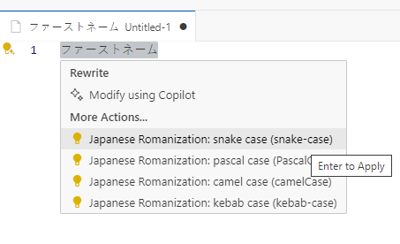
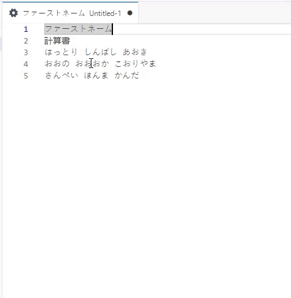

# japanese-romanization README

Help the developer to convert Japanese text to Romanization.

## Features

* Convert Japanese text (Hiragana, Katakana and Kanji) to Romanization (Hepburn style).

## Requirements

The language modes support by this extension are:
- javascript
- typescript
- csharp
- json
- plaintext
- ini
- markdown
- yaml
- xml
- html
- css
- scss
- less

## Usage

Select the text you want to convert and press ***control .*** (**control + period**) to convert the text.






## Extension Settings

This extension contributes the following settings:

* `provider`: Provider for convert Kanji text.
    * `offline` (**default**): Use the kuroshiro library to convert the text.
    * `goo`: Use the labs.goo.ne.jp API to convert the text.
* `apiKey`: API key for the labs.goo.ne.jp API. (Only required if the provider is goo)
* `cache` (default **false**): Cache the result of the conversion. (Faster convert for goo provider)

## Known Issues

N/A

## Development

```bash
yarn install
```

Then press F5 from visual studio code. If you get the warning: "The task 'npm: watch' cannot be tracked. Make sure to have a problem matcher defined." then click debug anyway.

## Release Notes

### 0.0.1

First draft version. Conversion using https://labs.goo.ne.jp

### 0.0.2

Support offline convertion.
Using kuroshiro: https://github.com/sglkc/kuroshiro-ts 

### 0.0.3

* Add settings to allow user to choose the provider.
* New command: import cache, export cache, clear cache.

### 0.1.0

* Allow user transform japanese to romaji using custom action.

### 0.2.0

* Update readme
* Update icon

### 0.2.1

* Add screenshort demo.
---
**Enjoy!**
